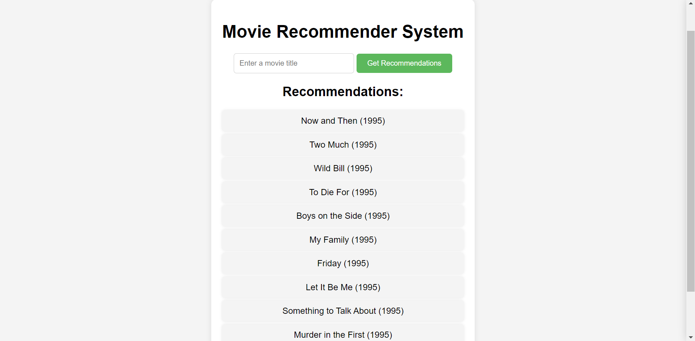

# Movie_Recommender_System
# Movie Recommendation System

This is a movie recommendation system built using machine learning algorithms. The system can recommend movies to users based on their past viewing history and preferences.



## Features

- User registration and authentication
- Movie recommendations based on collaborative filtering
- Responsive design
- User-friendly UI

## Installation

### Prerequisites

- Python 3.x
- Flask
- Git

### Setup Instructions

1. **Clone the repository:**

    ```sh
    git clone https://github.com/TarunChegondi/Movie_Recommendation_System.git
    cd Movie_Recommendation_System
    ```

2. **Create and activate a virtual environment:**

    ```sh
    python -m venv venv
    # For Windows
    .\venv\Scripts\activate
    # For macOS and Linux
    source venv/bin/activate
    ```

3. **Install the required packages:**

    ```sh
    pip install -r requirements.txt
    ```

4. **Set up the database:**

    ```sh
    flask db init
    flask db migrate -m "Initial migration"
    flask db upgrade
    ```

5. **Run the application:**

    ```sh
    flask run
    ```

6. **Access the application:**

    Open your web browser and go to `http://127.0.0.1:5000`.

## Large File Handling

This project uses Git Large File Storage (LFS) to manage large files.

### Installing Git LFS

- **Windows:** Download and install Git LFS from [Git LFS](https://git-lfs.github.com/).
- **macOS:** Use Homebrew:
  
  ```sh
  brew install git-lfs
